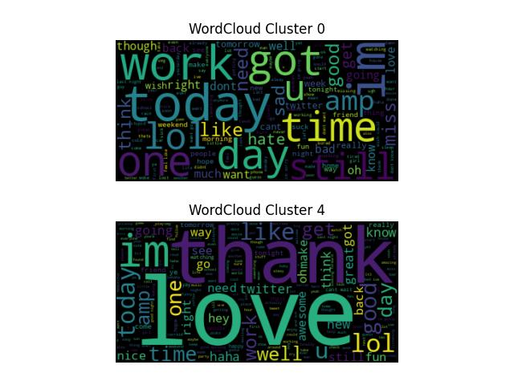

[](https://github.com/pylint-dev/pylint)
# PEC 4 - Ana Blanco - *twitter_nlp_uoc*
Repo: [casiopa/twitter_nlp_uoc](https://github.com/casiopa/twitter_nlp_uoc). Private until 27-jun-2023

## Index
1. [Intro](#intro)
2. [How to run the code](#How-to-run-the-code)
3. [*Linter*](#linter)
4. [Tests](#tests)
5. [Results](#results)

## Intro
This project contains the solution to the PEC4 for the course `Programming for Data Science` at
UOC University Master's Degree in Data Science. [PEC4 requirements document](docs/ES-PEC4-enun.pdf).

The code of this project is splited in 3 main files:
- `main.py` contains the execution of the project. This is the file that should be run.
- `sentiment_analyzer/uils.py` contains the mayority of the variables and functions
- `sentiment_analyzer/menu.py` contains auxiliary variables and functions for i/o purposes

`utils.py` and `menu.py` compose the `sentiment_analyzer` package that will be imported
with the command `import sentiment_analyzer as sa`.

The folder `test` contains unit testing for the package `sentiment_analyzer`.

Developed with python version: 3.10.6

### Execution parts
The execution has two separate parts:
- **Part 1**. This part starts from the beginning: Exercise 1. And it starts from the data file:
`data/twitter_reduced.csv`
- **Part 2**. This part includes the data analysis and begins in the exercise 5.
The execution can start from here as long as the `data/twitter_processed.csv` exists.

### Menu
At the start of the code excution this menu will appear to let us choose from witch part to begin
and whether to run it step by step or at once. These are the options of the menu:
```
Select one option
-----------------
[1] Run all PEC
[2] Run all PEC step by step
[3] Run PEC starting on Data Analysis (Ex. 5)
[4] Run PEC starting on Data Analysis (Ex. 5) step by step
[0] Exit

Select 0, 1, 2, 3 or 4:
```

## How to run the code
### Option A: Download the code from repo
This method is faster, as it includes the csv data files needed for the project.

1. Clone or download repo: 
   ```shell
   git clone https://github.com/casiopa/twitter_nlp_uoc
   ```
2. Get into the folder
   ```shell
   cd ./twitter_nlp_uoc
   ```
3. You can create a new virtual enviroment and activate it:
   ```shell
   virtualenv venv
   source venv/bin/activate
   ``` 
4. Install the required modules:
   ```shell
   pip install -r requirements.txt
   ``` 
5. Execute the code:
   ```shell
   python3 main.py
   ```

### Option B: Use zip file uploaded to Campus UOC
1. Unzip file
2. Get into the folder
   ```shell
   cd ./twitter_nlp_uoc
   ```
3. Copy `twitter_reduced.csv` file inside `data` folder
4. You can create a new virtual enviroment and activate it:
   ```shell
   virtualenv venv
   source venv/bin/activate
   ``` 
5. Install the required modules:
   ```shell
   pip install -r requirements.txt
   ``` 
6. Execute the code:
   ```shell
   python3 main.py
   ```

NOTE: In case you get this error in the execution:
`UserWarning: Matplotlib is currently using agg, which is a non-GUI backend, so cannot show the
figure.`, the problem is that you are trying to display a plot in a GUI window, but you do not have
a python module for GUI display. In this case you can solve the problem by installing `tkinter`:
```shell
sudo apt-get install python3-tk
```

## *Linter*
We are going to use `pylint` *linter*
### How to run *linter*
1. First install `pylint` library:
    ```bash
    sudo apt install pylint
    ```
2. Run the following command from the root folder:
    ```bash
    pylint *.py
    ```
### *linter* results  
```
Your code has been rated at 10.00/10
```

## Tests
Tests are located in the `test` folder.  
The code have been tested for the package `sentiment_analyzer`.
This package contains two modules:
- `menu.py`
- `utils.py`

All functions of these two modules have been tested except for the graphical ones:
`paint_2word_clouds` and `paint_2bars`.

### How to run the tests
Run the following command from the root folder:
```bash
python3 -m test.test_sentiment_analyzer
```

### Test results
```
ok test_file_exists (__main__.TestMenu)
ok test_stop_between_steps (__main__.TestMenu)
ok test_create_bows_vocab (__main__.TestUtils)
ok test_create_cluster_bow (__main__.TestUtils)
ok test_join_dicts_bows (__main__.TestUtils)
ok test_preprocess_data (__main__.TestUtils)
ok test_preprocess_text (__main__.TestUtils)
ok test_remove_stop_words (__main__.TestUtils)
```

### Tests coverage

#### How to run the tests coverage
1. First install Coverage.py library:
    ```bash
    pip install coverage
    ```
2. Run the following commands from the root folder:
   ```bash
   coverage run -m test.test_sentiment_analyzer
   coverage report
   ```
3. We can obtain a more detailed html report with these commands:
   ```bash
   coverage run -m test.test_sentiment_analyzer
   coverage html
   ```
   Follow this link, after executing above commands, to open the html report:
   [Coverage HTML report](htmlcov/index.html)

#### Tests coverage result
This is the tests coverage result for the package `sentiment_analyzer`. All functions from the
package `setiment_analyzer` have been tested except for the graphical ones:
`paint_2word_clouds` and `paint_2bars`.
```
Name                          Stmts   Miss  Cover
-------------------------------------------------
sentiment_analyzer/menu.py       14      1    93%
sentiment_analyzer/utils.py      72     26    64%
-------------------------------------------------
TOTAL                            86     27    69%
```

## Results
### Results printed to console
```
EXERCISE 1: Load data - Reading data file
        First 5 dicts (of 160000 total dicts): [{'sentiment': 0, 'id': 1467810369, 'date': 'Mon Apr 06 22:19:45 PDT 2009', 'query': 'NO_QUERY', 'user': '_TheSpecialOne_', 'text': "@switchfoot http://twitpic.com/2y1zl - Awww, that's a bummer.  You shoulda got David Carr of Third Day to do it. ;D"}, {'sentiment': 0, 'id': 1467810672, 'date': 'Mon Apr 06 22:19:49 PDT 2009', 'query': 'NO_QUERY', 'user': 'scotthamilton', 'text': "is upset that he can't update his Facebook by texting it... and might cry as a result  School today also. Blah!"}, {'sentiment': 0, 'id': 1467810917, 'date': 'Mon Apr 06 22:19:53 PDT 2009', 'query': 'NO_QUERY', 'user': 'mattycus', 'text': '@Kenichan I dived many times for the ball. Managed to save 50%  The rest go out of bounds'}, {'sentiment': 0, 'id': 1467811184, 'date': 'Mon Apr 06 22:19:57 PDT 2009', 'query': 'NO_QUERY', 'user': 'ElleCTF', 'text': 'my whole body feels itchy and like its on fire '}, {'sentiment': 0, 'id': 1467811193, 'date': 'Mon Apr 06 22:19:57 PDT 2009', 'query': 'NO_QUERY', 'user': 'Karoli', 'text': "@nationwideclass no, it's not behaving at all. i'm mad. why am i here? because I can't see you all over there. "}]

EXERCISE 2: Load data - Starting cleaning data
	INFO: Data cleaned
        First 5 dicts (of 160000): [{'sentiment': 0, 'id': 1467810369, 'date': 'Mon Apr 06 22:19:45 PDT 2009', 'query': 'NO_QUERY', 'user': '_TheSpecialOne_', 'text': 'switchfoot awww thats bummer shoulda got david carr third day d'}, {'sentiment': 0, 'id': 1467810672, 'date': 'Mon Apr 06 22:19:49 PDT 2009', 'query': 'NO_QUERY', 'user': 'scotthamilton', 'text': 'upset cant update facebook texting might cry result school today also blah'}, {'sentiment': 0, 'id': 1467810917, 'date': 'Mon Apr 06 22:19:53 PDT 2009', 'query': 'NO_QUERY', 'user': 'mattycus', 'text': 'kenichan dived many times ball managed save 50 rest go bounds'}, {'sentiment': 0, 'id': 1467811184, 'date': 'Mon Apr 06 22:19:57 PDT 2009', 'query': 'NO_QUERY', 'user': 'ElleCTF', 'text': 'whole body feels itchy like fire'}, {'sentiment': 0, 'id': 1467811193, 'date': 'Mon Apr 06 22:19:57 PDT 2009', 'query': 'NO_QUERY', 'user': 'Karoli', 'text': 'nationwideclass behaving im mad cant see'}]
        Last 5 dicts (of 160000): [{'sentiment': 4, 'id': 1685554684, 'date': 'Sun May 03 00:55:31 PDT 2009', 'query': 'NO_QUERY', 'user': 'Heidi_vb', 'text': 'morn waitin 4 sun 2 reappear cool havin 2 chase around chillin som coffee jst takin nice n slow haha'}, {'sentiment': 4, 'id': 1685554730, 'date': 'Sun May 03 00:55:31 PDT 2009', 'query': 'NO_QUERY', 'user': 'KrissyJill', 'text': 'still 3am good grief good night'}, {'sentiment': 4, 'id': 1685554798, 'date': 'Sun May 03 00:55:32 PDT 2009', 'query': 'NO_QUERY', 'user': 'dwmoook', 'text': 'morning world taking parents meal today ahem forgot ruby anniversary last week blame lisa'}, {'sentiment': 4, 'id': 1685554800, 'date': 'Sun May 03 00:55:32 PDT 2009', 'query': 'NO_QUERY', 'user': 'chastinevegas', 'text': 'drive ins funjust saying'}, {'sentiment': 4, 'id': 1685554911, 'date': 'Sun May 03 00:55:34 PDT 2009', 'query': 'NO_QUERY', 'user': 'bearyhwang', 'text': 'like twitter page background'}]

EXERCISE 3: Load data - Starting BoWs extraction
	INFO: Total bows to process: 160000
	INFO: Processing bow  40000 - Time elapsed: 21.011 seconds
	INFO: Processing bow  80000 - Time elapsed: 118.095 seconds
	INFO: Processing bow 120000 - Time elapsed: 271.942 seconds
	INFO: Processing bow 160000 - Time elapsed: 483.823 seconds
	First 5 bows (of 160000 total bows): [{'switchfoot': 1, 'awww': 1, 'thats': 1, 'bummer': 1, 'shoulda': 1, 'got': 1, 'david': 1, 'carr': 1, 'third': 1, 'day': 1, 'd': 1}, {'upset': 1, 'cant': 1, 'update': 1, 'facebook': 1, 'texting': 1, 'might': 1, 'cry': 1, 'result': 1, 'school': 1, 'today': 1, 'also': 1, 'blah': 1}, {'kenichan': 1, 'dived': 1, 'many': 1, 'times': 1, 'ball': 1, 'managed': 1, 'save': 1, '50': 1, 'rest': 1, 'go': 1, 'bounds': 1}, {'whole': 1, 'body': 1, 'feels': 1, 'itchy': 1, 'like': 1, 'fire': 1}, {'nationwideclass': 1, 'behaving': 1, 'im': 1, 'mad': 1, 'cant': 1, 'see': 1}]
	First 10 words of vocabulary (of 141001 total): ['0', '00', '000', '0000000000', '0007', '001', '0010', '0015', '0019', '001quot']

EXERCISE 4: Load data - Starting joining and writing BoWs
	Record 20 (index 19): {'sentiment': 0, 'id': 1467813782, 'date': 'Mon Apr 06 22:20:34 PDT 2009', 'query': 'NO_QUERY', 'user': 'gi_gi_bee', 'text': 'fakerpattypattz oh dear drinking forgotten table drinks', 'bow': {'fakerpattypattz': 1, 'oh': 1, 'dear': 1, 'drinking': 1, 'forgotten': 1, 'table': 1, 'drinks': 1}}
	INFO: twitter_processed.csv file wrote.

EXERCISE 5: Data Analysis - Word clouds
        5.1: The processed dataset has 2 clusters
        5.2: There are 36, 0.02% tweets without text variable
        5.3: Printing word clouds in pop-up

EXERCISE 6: Data Analysis - BoWs Bars
        Printing bar graph in pop-up

EXERCISE 7: Data Analysis - Conclusions
        a.  The most frequent positive words are: ['im', 'good', 'love', 'day', 'like', 'get', 'thanks', 'going', 'time', 'lol']
        b.  The most frequent negative words are: ['im', 'work', 'go', 'get', 'dont', 'cant', 'day', 'today', 'back', 'like'])
        c.  There are 27048 words in both positive and negative tweets.
            For example: ['amp', 'got', 'morning', 'going', 'much', 'tomorrow', 'get', 'need', 'oh', 'like']
        d.  We can see very positive words in the WordCloud for cluster 4, like: good, love, thanks, lol.
            And we can also see words that could be considered negative for cluster 0 as: work, dont, cant, back.
            As we can see, tokens need more preprocesing but we can see the positive-negative tendency of the clusters.
```

### Graphics
These graphics appears on the execution on a pop-up window and are also saved as images files
in `images` folder.  
  
  
